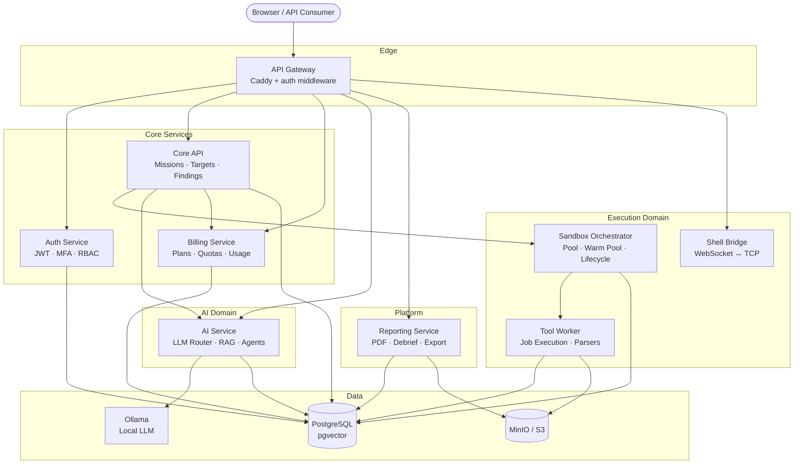
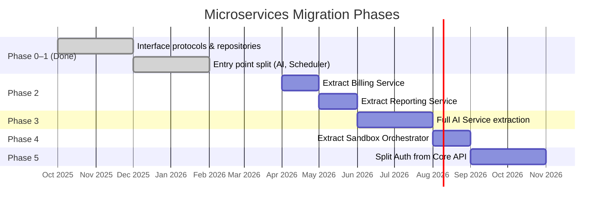

# Microservices Decomposition

[← Wiki Home](home.md) | [Sandboxes](sandboxes.md) | [Scaling](scaling.md)

---

## Current Status

| Phase | Description | Status |
|-------|-------------|--------|
| **Phase 0** | Gateway-ready interfaces (`ServiceRegistry`, `GatewayClient`) | **Done** |
| **Phase 1** | Entry point split — AI Service, Scheduler Service | **Done** |
| **Phase 2** | Extract Billing & Reporting as standalone services | Planned |
| **Phase 3** | Extract Sandbox Orchestrator | Planned (gateway pattern already in place) |
| **Phase 4** | Split Auth from Core API | Planned |

### What's Implemented

- **AI Service** — [`app/ai_service.py`](../../app/ai_service.py) runs as a standalone FastAPI app exposing `/api/v1/ai/chat`, `/api/v1/ai/embed`, and `/health`.
- **Scheduler Service** — [`app/scheduler_service.py`](../../app/scheduler_service.py) runs as a headless process handling sandbox watchdog, quota resets, metrics collection, and health reporting.
- **Services Compose overlay** — [`docker/docker-compose.services.yml`](../../docker/docker-compose.services.yml) defines the split: `spectra-api` (core), `spectra-ai-svc` (port 5010), and `spectra-scheduler` (no port).
- **Sandbox Orchestrator gateway** — `SandboxOrchestratorClient` in `app/services/gateway/sandbox_orchestrator.py` routes to a remote orchestrator when `SANDBOX_ORCHESTRATOR_URL` is set.
- **LLM gateway** — `LLMGatewayClient` routes to a remote LLM service when `LLM_GATEWAY_URL` is set.

To run in microservices mode:

```bash
docker compose -f docker/docker-compose.yml -f docker/docker-compose.services.yml up -d
```

---

Architecture plan for decomposing the Spectra monolith into independently deployable services.

## 1. Executive Summary

The Spectra backend (`spectra-app`) is a single FastAPI process that serves the Web UI, API gateway, AI orchestration, billing, reporting, shell sessions, and admin functions. While this monolith simplified the initial build, it creates concrete problems at scale:

| Problem | Impact |
|---|---|
| **Blast radius** | An OOM in PDF generation or a runaway LLM stream takes down the entire API |
| **Scaling granularity** | AI inference and sandbox orchestration need GPU/high-memory nodes; auth and billing do not |
| **Deploy cadence** | A billing label change requires redeploying the whole application |
| **Team ownership** | No clear module boundaries — every PR touches shared database sessions and config |

The existing codebase already has two footholds into a service-oriented design:

1. **`ServiceRegistry`** in `app/services/gateway/service_registry.py` — routes sandbox operations to a remote HTTP orchestrator when `SANDBOX_ORCHESTRATOR_URL` is set, falling back to in-process Docker calls otherwise.
2. **`spectra-tools`** container — a separate Kali worker that processes jobs from a per-mission PostgreSQL queue via `LISTEN`/`NOTIFY`.

This plan extends those patterns to seven additional bounded contexts, using PostgreSQL-native messaging (`NOTIFY`/`LISTEN`) already proven in the job queue, and the `GatewayClient` HTTP base class already in `app/services/gateway/http_client.py`.

---

## 2. Target Service Architecture

### 2.1 Service Map



### 2.2 Service Definitions

#### API Gateway (`spectra-gateway`)

| Attribute | Value |
|---|---|
| **Base** | Caddy 2 (current) + custom auth middleware |
| **Responsibilities** | TLS termination, request routing, rate limiting, JWT validation, CORS |
| **Current code** | `Caddyfile`, `app/core/rate_limit.py`, CORS config in `app/core/config.py` |
| **Port** | 80 / 443 (external) |

The existing Caddy reverse proxy already handles edge concerns. The split adds a token-introspection sidecar (or Caddy plugin) so downstream services receive a validated `X-User-Id` / `X-User-Role` header pair instead of raw JWTs.

#### Auth Service (`spectra-auth`)

| Attribute | Value |
|---|---|
| **Source modules** | `app/api/routers/auth.py`, `app/core/security.py`, `app/core/rbac.py`, `app/models/user.py` |
| **Responsibilities** | Login, registration, JWT issuance/refresh, MFA enrollment/verify, password reset, RBAC evaluation |
| **API surface** | `POST /auth/login`, `POST /auth/register`, `POST /auth/refresh`, `POST /auth/mfa/*`, `GET /auth/me` |
| **Data owned** | `users` table, MFA secrets |

#### Core API (`spectra-core`)

| Attribute | Value |
|---|---|
| **Source modules** | `app/api/routers/missions.py`, `targets.py`, `findings.py`, `exploits.py`, `pentest_sessions.py`, `cve.py` |
| **Responsibilities** | Mission CRUD, target scoping, findings management, mission orchestration loop, dashboard endpoints |
| **API surface** | `/api/missions/*`, `/api/targets/*`, `/api/findings/*`, `/api/exploits/*` |
| **Data owned** | `missions`, `targets`, `findings`, `exploits`, `pentest_sessions`, `attack_surfaces` |

Core API is the primary orchestrator: it starts missions, requests AI plans, dispatches tool jobs to sandboxes, and collects results.

#### AI Service (`spectra-ai`)

| Attribute | Value |
|---|---|
| **Source modules** | `app/services/ai/` (router, llm, agents/, rag, embeddings, consensus, context, prompts, etc.) |
| **Responsibilities** | LLM routing (tier 1/2/3), embedding generation, RAG search, agent orchestration, consensus voting, cost tracking |
| **API surface** | `POST /v1/generate`, `POST /v1/embed`, `POST /v1/rag/search`, `POST /v1/agents/invoke` |
| **Data owned** | `rag_documents` (pgvector), LLM cost/usage metrics |

Already uses a provider-agnostic `SmartRouter` (`app/services/ai/router.py`) with `LiteLLM`. This service wraps that router behind an HTTP API using the same `GatewayClient` pattern. Config controlled by `LLM_API_BASE_URL`, `AI_PROVIDER`, model tier settings.

#### Sandbox Orchestrator (`spectra-orchestrator`)

| Attribute | Value |
|---|---|
| **Source modules** | `app/services/tools/sandbox/`, `app/services/scaling/pool_manager.py`, `app/models/infrastructure.py` (Sandbox) |
| **Responsibilities** | Container lifecycle (create/destroy), warm pool management, OOM escalation, golden image builds, network isolation, heartbeat monitoring |
| **API surface** | `POST /v1/sandboxes`, `DELETE /v1/sandboxes/{mission_id}`, `GET /v1/sandboxes/{mission_id}/status` |
| **Data owned** | `sandboxes`, `server_nodes` |

**Already partially extracted.** `SandboxOrchestratorClient` in `app/services/gateway/sandbox_orchestrator.py` implements the HTTP contract. When `SANDBOX_ORCHESTRATOR_URL` is set, the monolith becomes a client. This plan promotes the in-process `SandboxPool` into a standalone FastAPI service that exposes those same endpoints.

#### Tool Worker (`spectra-worker`)

| Attribute | Value |
|---|---|
| **Source modules** | `app/worker/` (tool_jobs, command_jobs, vpn_jobs, report_jobs, cleanup_jobs) |
| **Responsibilities** | Execute tool commands (nmap, nuclei, etc.), parse output, manage VPN connections, push results to job queue |
| **Communication** | PostgreSQL `LISTEN`/`NOTIFY` on per-mission queue (`spectra_jobs_mission_{id}`) |
| **Data owned** | None (writes job results back to `job_queue`) |

Already runs in a separate container (`spectra-tools`). No API surface — it consumes jobs from `job_queue` and writes results. Unchanged in the split.

#### Reporting Service (`spectra-reporting`)

| Attribute | Value |
|---|---|
| **Source modules** | `app/services/mission/report_generator.py`, `app/api/routers/export.py`, `app/worker/report_jobs.py` |
| **Responsibilities** | HTML/PDF report generation, data export (CSV/JSON), encrypted report storage, executive summaries |
| **API surface** | `POST /v1/reports/generate`, `GET /v1/reports/{id}`, `GET /v1/export/{entity}` |
| **Data owned** | Generated report artifacts in S3 |

Stateless — reads mission/finding data from Core API (or shared DB view), renders templates, stores output in S3/MinIO.

#### Billing Service (`spectra-billing`)

| Attribute | Value |
|---|---|
| **Source modules** | `app/services/billing/` (usage_tracker, quota_enforcer), `app/api/routers/admin/plans.py`, `app/models/plan.py` |
| **Responsibilities** | Plan CRUD, subscription management, usage metering, quota enforcement, API key issuance |
| **API surface** | `GET /v1/plans`, `POST /v1/usage/record`, `GET /v1/quota/check/{user_id}`, `POST /v1/api-keys` |
| **Data owned** | `plans`, `subscriptions`, `api_keys`, `usage_records` |

---

## 3. Data Ownership

### 3.1 Schema-Per-Service Strategy

Use PostgreSQL schemas within a single database cluster to isolate ownership while keeping joins available during migration. Each service owns one schema and has read-write access only to it.

```sql
-- Create schemas
CREATE SCHEMA auth;        -- Auth Service
CREATE SCHEMA core;        -- Core API
CREATE SCHEMA billing;     -- Billing Service
CREATE SCHEMA ai;          -- AI Service
CREATE SCHEMA infra;       -- Sandbox Orchestrator
CREATE SCHEMA reporting;   -- Reporting Service (minimal — mostly S3)

-- Move tables into their schemas
ALTER TABLE users           SET SCHEMA auth;
ALTER TABLE audit_logs      SET SCHEMA auth;

ALTER TABLE missions        SET SCHEMA core;
ALTER TABLE targets         SET SCHEMA core;
ALTER TABLE findings        SET SCHEMA core;
ALTER TABLE exploits        SET SCHEMA core;
ALTER TABLE pentest_sessions SET SCHEMA core;

ALTER TABLE plans           SET SCHEMA billing;
ALTER TABLE subscriptions   SET SCHEMA billing;
ALTER TABLE api_keys        SET SCHEMA billing;
ALTER TABLE usage_records   SET SCHEMA billing;

ALTER TABLE sandboxes       SET SCHEMA infra;
ALTER TABLE server_nodes    SET SCHEMA infra;
ALTER TABLE job_queue       SET SCHEMA infra;

ALTER TABLE system_cache    SET SCHEMA infra;
ALTER TABLE cache_entries   SET SCHEMA infra;
ALTER TABLE system_status   SET SCHEMA infra;
ALTER TABLE system_config   SET SCHEMA infra;
ALTER TABLE system_content  SET SCHEMA infra;
```

### 3.2 Table Ownership Matrix

| Table | Owner Service | Readers |
|---|---|---|
| `users` | Auth | Core API, Billing, Admin |
| `audit_logs` | Auth | Admin (read-only) |
| `missions` | Core API | Reporting, AI, Billing |
| `targets` | Core API | AI, Reporting |
| `findings` | Core API | Reporting, AI |
| `exploits` | Core API | AI, Reporting |
| `pentest_sessions` | Core API | — |
| `plans` | Billing | Auth (read-only for feature flags), Core API |
| `subscriptions` | Billing | Auth, Core API |
| `api_keys` | Billing | Gateway (validation) |
| `usage_records` | Billing | Admin (read-only) |
| `job_queue` | Orchestrator | Tool Worker (claim + update) |
| `sandboxes` | Orchestrator | Core API (read-only status) |
| `server_nodes` | Orchestrator | Admin (read-only) |
| `system_cache` | Orchestrator | All (read) |
| RAG vectors | AI Service | Core API (search only) |

### 3.3 Cross-Service Data Access

During the transitional period (schemas in one database), services access other schemas via **read-only PostgreSQL roles**:

```sql
-- Billing can read users to validate subscription ownership
CREATE ROLE billing_ro NOLOGIN;
GRANT USAGE ON SCHEMA auth TO billing_ro;
GRANT SELECT ON auth.users TO billing_ro;

-- Reporting can read missions and findings
CREATE ROLE reporting_ro NOLOGIN;
GRANT USAGE ON SCHEMA core TO reporting_ro;
GRANT SELECT ON core.missions, core.targets, core.findings, core.exploits TO reporting_ro;
```

For the final state (separate databases), cross-service reads are replaced by synchronous API calls or materialized views refreshed via events.

---

## 4. Communication Patterns

### 4.1 Synchronous — REST (Internal)

Service-to-service calls use the existing `GatewayClient` base class from `app/services/gateway/http_client.py`, which already provides retry with exponential backoff, connection pooling, and bearer-token auth.

```python
# Core API → Billing Service: check quota before mission start
from app.services.gateway.http_client import GatewayClient

billing = GatewayClient(
    settings.BILLING_SERVICE_URL,   # e.g., "http://spectra-billing:8001"
    api_key=settings.INTERNAL_SERVICE_KEY,
)

async def check_user_quota(user_id: str, metric: str) -> bool:
    result = await billing.get(f"/v1/quota/check/{user_id}?metric={metric}")
    return result.get("allowed", False)
```

```python
# Core API → AI Service: request a mission plan
ai = GatewayClient(settings.AI_SERVICE_URL)

async def get_mission_plan(mission_context: dict) -> dict:
    return await ai.post("/v1/agents/invoke", json={
        "agent": "planner",
        "context": mission_context,
    })
```

### 4.2 Asynchronous — PostgreSQL NOTIFY/LISTEN

Spectra already uses PostgreSQL `NOTIFY`/`LISTEN` for the job queue (`spectra_jobs_mission_{id}`). The same mechanism extends to domain events without adding an external message broker.

```python
# Publishing: Core API emits an event when a mission completes
async def emit_event(session, channel: str, payload: dict):
    import json
    stmt = f"SELECT pg_notify(:channel, :payload)"
    await session.execute(
        text(stmt),
        {"channel": channel, "payload": json.dumps(payload)},
    )

# Usage in mission completion handler:
await emit_event(session, "spectra_events", {
    "type": "mission_completed",
    "mission_id": mission.id,
    "user_id": mission.user_id,
})
```

```python
# Subscribing: Billing Service listens for usage events
import asyncio, json, asyncpg

async def listen_events(dsn: str):
    conn = await asyncpg.connect(dsn)
    await conn.add_listener("spectra_events", _handle_event)
    while True:
        await asyncio.sleep(1)

def _handle_event(conn, pid, channel, payload):
    event = json.loads(payload)
    if event["type"] == "mission_completed":
        asyncio.create_task(record_usage(event["user_id"], "missions_started"))
    elif event["type"] == "finding_discovered":
        asyncio.create_task(check_alert_threshold(event))
```

### 4.3 Event Catalog

These events map directly to the existing `EventType` enum in `app/core/events.py`:

| Event | Publisher | Subscribers |
|---|---|---|
| `mission_created` | Core API | Billing (quota check), AI (pre-warm context) |
| `mission_completed` | Core API | Billing (record usage), Reporting (auto-generate) |
| `mission_failed` | Core API | Billing (refund quota) |
| `finding_discovered` | Core API | Reporting (live stats), AI (update RAG) |
| `finding_verified` | AI Service | Core API (update status) |
| `tool_execution_completed` | Worker | Core API (process results), AI (parse output) |
| `sandbox_created` | Orchestrator | Core API (update mission status) |
| `sandbox_destroyed` | Orchestrator | Billing (record sandbox minutes) |
| `quota_exceeded` | Billing | Core API (reject request), Gateway (rate limit) |
| `plan_changed` | Billing | Auth (update feature flags cache) |

### 4.4 Service Discovery

In Docker Compose, services resolve by container name (e.g., `http://spectra-billing:8001`). In Kubernetes, use headless services or DNS. Configuration follows the existing pattern — environment variables:

```bash
# .env additions for split services
AUTH_SERVICE_URL=http://spectra-auth:8000
BILLING_SERVICE_URL=http://spectra-billing:8001
AI_SERVICE_URL=http://spectra-ai:8002
ORCHESTRATOR_SERVICE_URL=http://spectra-orchestrator:8003
REPORTING_SERVICE_URL=http://spectra-reporting:8004
INTERNAL_SERVICE_KEY=<shared-secret-for-service-to-service>
```

---

## 5. Migration Strategy

### Phase 0 — Preparation (Current → Gateway-Ready)

**Goal:** Ensure every cross-domain call goes through an interface that can be swapped.

1. Define service interface protocols (Python `Protocol` classes) for Billing, AI, and Reporting.
2. Wrap all direct imports with factory functions following the `ServiceRegistry` pattern.
3. Move each domain's DB queries into repository classes (some already exist in `app/repositories/`).
4. Add PostgreSQL schema prefixes to Alembic migrations (no data moves yet).

```python
# Example: billing interface protocol
from typing import Protocol

class BillingService(Protocol):
    async def check_quota(self, user_id: str, metric: str) -> bool: ...
    async def record_usage(self, user_id: str, metric: str, amount: int) -> None: ...
    async def get_plan(self, user_id: str) -> dict: ...
```

### Phase 1 — Entry Point Split (Done)

The monolith's AI and scheduler concerns have been extracted into separate entry points that run as independent containers while sharing the same codebase.

| Step | Action | Status |
|---|---|---|
| 1a | Create `app/ai_service.py` — standalone FastAPI app for LLM routing, embeddings, RAG | **Done** |
| 1b | Create `app/scheduler_service.py` — headless service for background tasks (sandbox watchdog, quota reset, metrics) | **Done** |
| 1c | Create `docker/docker-compose.services.yml` — overlay that splits `app` into `api`, `ai-svc`, and `scheduler` | **Done** |
| 1d | AI service exposes `/api/v1/ai/chat`, `/api/v1/ai/embed`, `/health` on port 5010 | **Done** |
| 1e | Core API routes AI requests to `AI_SERVICE_URL` when set | **Done** |

**Rollback:** Remove the services overlay and restart with only `docker-compose.yml` — the monolith still includes all functionality.

### Phase 2 — Extract Billing & Reporting (Next)

**Risk:** Low — these domains have the fewest inbound dependencies.

| Step | Action |
|---|---|
| 2a | Create `services/billing/` FastAPI app with its own `Dockerfile` |
| 2b | Move `plans`, `subscriptions`, `api_keys`, `usage_records` tables to `billing` schema |
| 2c | Wire `BillingGatewayClient` (extends `GatewayClient`) into `ServiceRegistry` |
| 2d | Deploy both billing service and monolith; monolith calls billing via HTTP when `BILLING_SERVICE_URL` is set |
| 2e | Repeat for Reporting (minimal data ownership — mostly reads + S3 writes) |

**Rollback:** Unset `BILLING_SERVICE_URL` → monolith falls back to in-process code.

### Phase 3 — Full AI Service Extraction

**Risk:** Medium — high traffic, latency-sensitive. Phase 1 already split the entry point; this phase completes the extraction with its own database pool and independent deployment.

| Step | Action |
|---|---|
| 3a | Give `app/ai_service.py` its own dedicated database connection pool and Dockerfile |
| 3b | Add remaining endpoints: `/v1/rag/search`, `/v1/agents/invoke` |
| 3c | RAG vectors stay in the shared PostgreSQL (pgvector); AI service gets a dedicated connection pool |
| 3d | Wire `AIGatewayClient` into `ServiceRegistry` gated by `AI_SERVICE_URL` (partially done) |
| 3e | Deploy on GPU nodes separate from the API tier |

### Phase 4 — Extract Sandbox Orchestrator

**Risk:** Low — already has the gateway pattern (`SANDBOX_ORCHESTRATOR_URL`).

| Step | Action |
|---|---|
| 4a | Promote in-process `SandboxPool` into a standalone FastAPI service |
| 4b | The existing `SandboxOrchestratorClient` contract (`POST /v1/sandboxes`, `DELETE /v1/sandboxes/{id}`) becomes the real API |
| 4c | Move Docker socket mount from `spectra-app` to `spectra-orchestrator` only |
| 4d | Orchestrator manages warm pool, heartbeat, OOM escalation, golden image builds |

### Phase 5 — Split Auth from Core API

**Risk:** Highest — auth is on the critical path for every request.

| Step | Action |
|---|---|
| 5a | Extract JWT issuance/validation into `spectra-auth` |
| 5b | Gateway validates tokens by calling auth service (or verifying with a shared public key for RS256) |
| 5c | Migrate from HS256 to RS256 so the gateway can validate tokens without calling auth — reduces latency |
| 5d | `users` table moves to `auth` schema; other services get read-only access via API or read replica |

**Migration timeline (suggested):**



    section Phase 3
    Full AI Service extraction :p3, 2026-06, 2026-08

    section Phase 4
    Extract Sandbox Orchestrator :p4, 2026-08, 2026-09

    section Phase 5
    Split Auth from Core API   :p5, 2026-09, 2026-11
```

---

## 6. Shared Libraries

Extract these into internal Python packages (installable via `pip install -e ./libs/<pkg>` in a private PyPI/repo/whatever is easiest):

### `spectra-common`

| Module | Contents | Current Location |
|---|---|---|
| `spectra_common.models` | SQLAlchemy `Base`, `InfrastructureBase`, `JSONBType`, shared mixins | `app/models/base.py`, `app/models/infrastructure.py` |
| `spectra_common.schemas` | Pydantic request/response schemas used by multiple services | `app/api/schemas/` |
| `spectra_common.auth` | Token validation, RBAC evaluation (read-only — no issuance) | `app/core/security.py` (verify functions), `app/core/rbac.py` |
| `spectra_common.config` | Base `Settings` class, shared env var names | `app/core/config.py` (subset) |
| `spectra_common.events` | `EventType` enum, `pg_notify` / `pg_listen` helpers | `app/core/events.py` |
| `spectra_common.telemetry` | Span/metric recording, OpenTelemetry bootstrap | `app/core/telemetry.py` |
| `spectra_common.gateway` | `GatewayClient` base class | `app/services/gateway/http_client.py` |
| `spectra_common.constants` | Shared constants (page sizes, timeouts) | `app/core/constants.py` |

### Package structure

```
libs/
  spectra-common/
    pyproject.toml
    spectra_common/
      __init__.py
      models/
      schemas/
      auth/
      config.py
      events.py
      telemetry.py
      gateway.py
      constants.py
```

Each service's `pyproject.toml` declares `spectra-common` as a dependency. In Docker builds, copy the `libs/` directory first for layer caching.

---

## 7. Deployment & Infrastructure

### 7.1 Docker Compose (Development)

```yaml
# docker/docker-compose.split.yml (development overlay)
services:
  gateway:
    image: caddy:2-alpine
    ports: ["80:80", "443:443"]
    volumes:
      - ./Caddyfile.split:/etc/caddy/Caddyfile:ro
    depends_on: [auth, core, billing, ai-service, reporting]
    networks: [spectra-network]

  auth:
    build: { context: .., dockerfile: docker/Dockerfile.auth }
    expose: ["8000"]
    environment:
      DATABASE_URL: postgresql+asyncpg://spectra:${POSTGRES_PASSWORD}@db:5432/spectra
      INTERNAL_SERVICE_KEY: ${INTERNAL_SERVICE_KEY}
    depends_on: { db: { condition: service_healthy } }
    networks: [spectra-network]

  core:
    build: { context: .., dockerfile: docker/Dockerfile.core }
    expose: ["5000"]
    environment:
      DATABASE_URL: postgresql+asyncpg://spectra:${POSTGRES_PASSWORD}@db:5432/spectra
      AUTH_SERVICE_URL: http://auth:8000
      BILLING_SERVICE_URL: http://billing:8001
      AI_SERVICE_URL: http://ai-service:8002
      ORCHESTRATOR_SERVICE_URL: http://orchestrator:8003
      REPORTING_SERVICE_URL: http://reporting:8004
    depends_on: { db: { condition: service_healthy } }
    networks: [spectra-network]

  billing:
    build: { context: .., dockerfile: docker/Dockerfile.billing }
    expose: ["8001"]
    environment:
      DATABASE_URL: postgresql+asyncpg://spectra:${POSTGRES_PASSWORD}@db:5432/spectra
    depends_on: { db: { condition: service_healthy } }
    networks: [spectra-network]

  ai-service:
    build: { context: .., dockerfile: docker/Dockerfile.ai-service }
    expose: ["8002"]
    environment:
      DATABASE_URL: postgresql+asyncpg://spectra:${POSTGRES_PASSWORD}@db:5432/spectra
      AI_PROVIDER: ${AI_PROVIDER:-litellm}
      LLM_API_KEY: ${LLM_API_KEY}
      LLM_API_BASE_URL: ${LLM_API_BASE_URL}
    depends_on: { db: { condition: service_healthy } }
    networks: [spectra-network]

  orchestrator:
    build: { context: .., dockerfile: docker/Dockerfile.orchestrator }
    expose: ["8003"]
    volumes:
      - /var/run/docker.sock:/var/run/docker.sock
    environment:
      DATABASE_URL: postgresql+asyncpg://spectra:${POSTGRES_PASSWORD}@db:5432/spectra
    depends_on: { db: { condition: service_healthy } }
    networks: [spectra-network]

  reporting:
    build: { context: .., dockerfile: docker/Dockerfile.reporting }
    expose: ["8004"]
    environment:
      DATABASE_URL: postgresql+asyncpg://spectra:${POSTGRES_PASSWORD}@db:5432/spectra
      S3_ENDPOINT_URL: http://minio:9000
    depends_on: { db: { condition: service_healthy } }
    networks: [spectra-network]

  # Existing services unchanged
  db:
    image: pgvector/pgvector:pg16
    # ... (same as current docker-compose.yml)

  minio:
    image: minio/minio:latest
    # ... (same as current docker-compose.yml)

  tools:
    build: { context: .., dockerfile: docker/Dockerfile.tools }
    # ... (same as current — consumes job_queue)
```

### 7.2 Kubernetes (Production)

Each service becomes a `Deployment` + `Service` + `HPA`:

```yaml
# k8s/core-api/deployment.yaml (representative example)
apiVersion: apps/v1
kind: Deployment
metadata:
  name: spectra-core
  labels: { app: spectra, component: core }
spec:
  replicas: 2
  selector:
    matchLabels: { app: spectra, component: core }
  template:
    metadata:
      labels: { app: spectra, component: core }
    spec:
      containers:
        - name: core
          image: ghcr.io/spectra/core:latest
          ports: [{ containerPort: 5000 }]
          envFrom: [{ secretRef: { name: spectra-core-secrets } }]
          resources:
            requests: { cpu: "250m", memory: "256Mi" }
            limits: { cpu: "1", memory: "1Gi" }
          readinessProbe:
            httpGet: { path: /api/health, port: 5000 }
            periodSeconds: 10
---
apiVersion: autoscaling/v2
kind: HorizontalPodAutoscaler
metadata:
  name: spectra-core-hpa
spec:
  scaleTargetRef:
    apiVersion: apps/v1
    kind: Deployment
    name: spectra-core
  minReplicas: 2
  maxReplicas: 10
  metrics:
    - type: Resource
      resource: { name: cpu, target: { type: Utilization, averageUtilization: 70 } }
```

**AI Service** gets a separate node pool with GPU taints:

```yaml
spec:
  nodeSelector:
    gpu: "true"
  tolerations:
    - key: nvidia.com/gpu
      operator: Exists
      effect: NoSchedule
```

### 7.3 Secrets Management

| Scope | Mechanism |
|---|---|
| Development | `.env` file (current) |
| Docker Compose prod | Docker secrets or `.env` with restrictive permissions |
| Kubernetes | `Secret` resources, sealed-secrets, or Vault CSI driver |
| Service-to-service | Shared `INTERNAL_SERVICE_KEY` signed with HMAC; rotate via Kubernetes `Secret` |

Each service receives only the secrets it needs:

| Service | Secrets Required |
|---|---|
| Auth | `JWT_SECRET_KEY`, `SECRET_KEY`, `DATABASE_URL`, `SMTP_*` |
| Core API | `DATABASE_URL`, `INTERNAL_SERVICE_KEY` |
| Billing | `DATABASE_URL`, `INTERNAL_SERVICE_KEY` |
| AI Service | `DATABASE_URL`, `LLM_API_KEY`, `EMBEDDING_API_KEY` |
| Orchestrator | `DATABASE_URL`, `INTERNAL_SERVICE_KEY` |
| Reporting | `DATABASE_URL`, `S3_ACCESS_KEY`, `S3_SECRET_KEY` |

---

## 8. Risks & Mitigations

### 8.1 Distributed Transactions

**Risk:** Mission creation involves writing to `missions`, checking `billing.subscriptions`, and creating a `sandbox` — currently one database transaction.

**Mitigation:** Use the **saga pattern** with compensating actions:

```
1. Core API → Billing: reserve quota  (compensate: release quota)
2. Core API → DB: create mission      (compensate: delete mission)
3. Core API → Orchestrator: create sandbox (compensate: destroy sandbox)
   On failure at step 3 → run compensations 2, 1 in reverse
```

The existing `EventType` enum (`MISSION_FAILED`, `MISSION_CANCELLED`) already models failure states that become saga compensation triggers.

### 8.2 Data Consistency

**Risk:** A billing quota check passes, but by the time the mission is created, another request exhausts the quota.

**Mitigation:**
- Billing service uses `SELECT ... FOR UPDATE` on the usage row during reservation.
- Reservations expire after 60 seconds if not confirmed.
- Idempotency keys on all mutating inter-service requests (already supported by `job_queue.id` pattern).

### 8.3 Network Partitions

**Risk:** If the billing service is down, no missions can start.

**Mitigation:**
- `GatewayClient` already has retry + exponential backoff.
- Add circuit breakers (the `app/core/events.py` `EventType` already defines `CIRCUIT_BREAKER_OPENED`/`CLOSED`).
- Degrade gracefully: allow mission start with a cached quota check; reconcile later.

### 8.4 Operational Complexity

**Risk:** 8 services × (logs + metrics + deploys + configs) = significantly more operational surface.

**Mitigation:**
- Shared `spectra-common` library ensures consistent logging format, telemetry, and health-check endpoints.
- Centralized logging via structured JSON (`LOG_FORMAT=json` already supported in `config.py`).
- Single `docker-compose.yml` for local dev — developers still run `docker compose up`.
- Phased rollout — the monolith continues to work at every phase; services are extracted incrementally.

### 8.5 Latency Increase

**Risk:** In-process function calls become HTTP round-trips.

**Mitigation:**
- Hot paths (auth validation) use asymmetric JWT (RS256) — the gateway validates locally with the public key, no network call.
- Quota checks are cached with TTL at the Core API level using `cache_entries` table.
- AI calls are already network-bound (LLM inference); wrapping in one more hop adds negligible overhead.
- All internal traffic stays on the Docker/Kubernetes overlay network — sub-millisecond latency.

---

## Appendix: Current Monolith Module → Service Mapping

| Monolith Module | Target Service |
|---|---|
| `app/api/routers/auth.py` | Auth |
| `app/core/security.py` | Auth + `spectra-common` |
| `app/core/rbac.py` | Auth + `spectra-common` |
| `app/api/routers/missions.py` | Core API |
| `app/api/routers/targets.py` | Core API |
| `app/api/routers/findings.py` | Core API |
| `app/api/routers/exploits.py` | Core API |
| `app/api/routers/pentest_sessions.py` | Core API |
| `app/api/routers/cve.py` | Core API |
| `app/api/routers/shell.py` | Core API (Shell Bridge) |
| `app/api/routers/tools.py` | Core API |
| `app/api/routers/export.py` | Reporting |
| `app/api/routers/admin/plans.py` | Billing |
| `app/api/routers/admin/users.py` | Auth |
| `app/api/routers/admin/servers.py` | Orchestrator |
| `app/api/routers/admin/content.py` | Core API (Admin) |
| `app/api/routers/admin/audit.py` | Auth |
| `app/api/routers/observability.py` | Core API (+ `spectra-common` telemetry) |
| `app/api/routers/health.py` | Each service gets its own `/health` |
| `app/api/routers/ui.py` | Gateway (static files) |
| `app/api/routers/public.py` | Gateway (static pages) |
| `app/services/ai/*` | AI Service |
| `app/services/billing/*` | Billing |
| `app/services/tools/sandbox/*` | Orchestrator |
| `app/services/tools/registry/*` | Core API |
| `app/services/tools/execution.py` | Core API (dispatch) + Worker (execute) |
| `app/services/shell/*` | Core API (Shell Bridge) |
| `app/services/mission/*` | Core API + Reporting |
| `app/services/rag/*` | AI Service |
| `app/services/scaling/*` | Orchestrator |
| `app/services/storage/*` | `spectra-common` |
| `app/services/gateway/*` | `spectra-common` |
| `app/worker/*` | Tool Worker |
| `app/core/config.py` | `spectra-common` (base) + per-service extensions |
| `app/core/events.py` | `spectra-common` |
| `app/core/telemetry.py` | `spectra-common` |
| `app/core/constants.py` | `spectra-common` |
