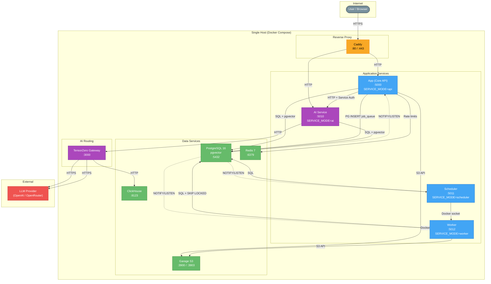
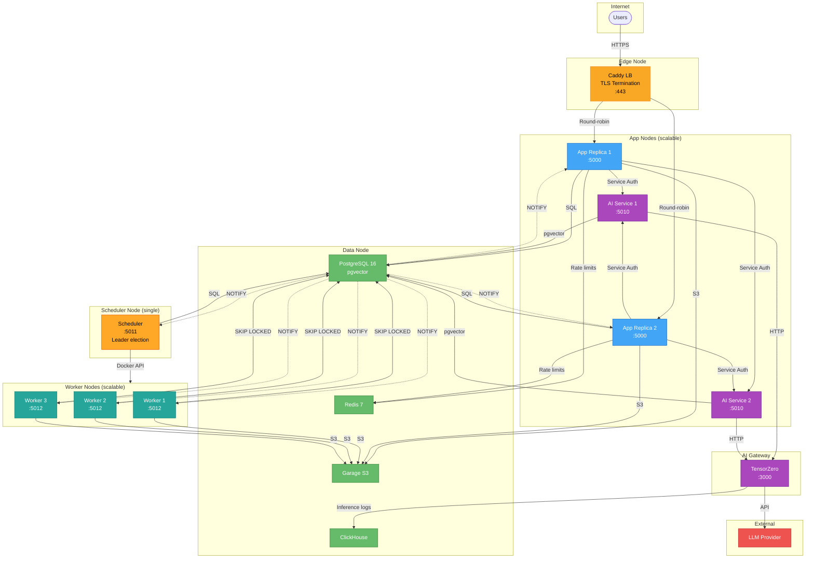
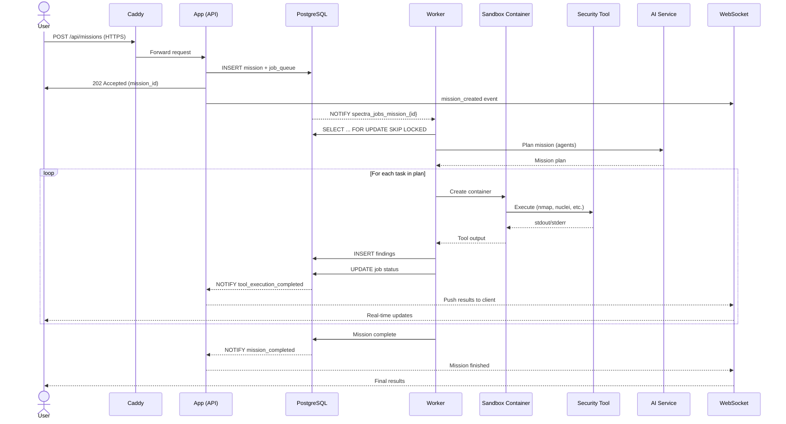
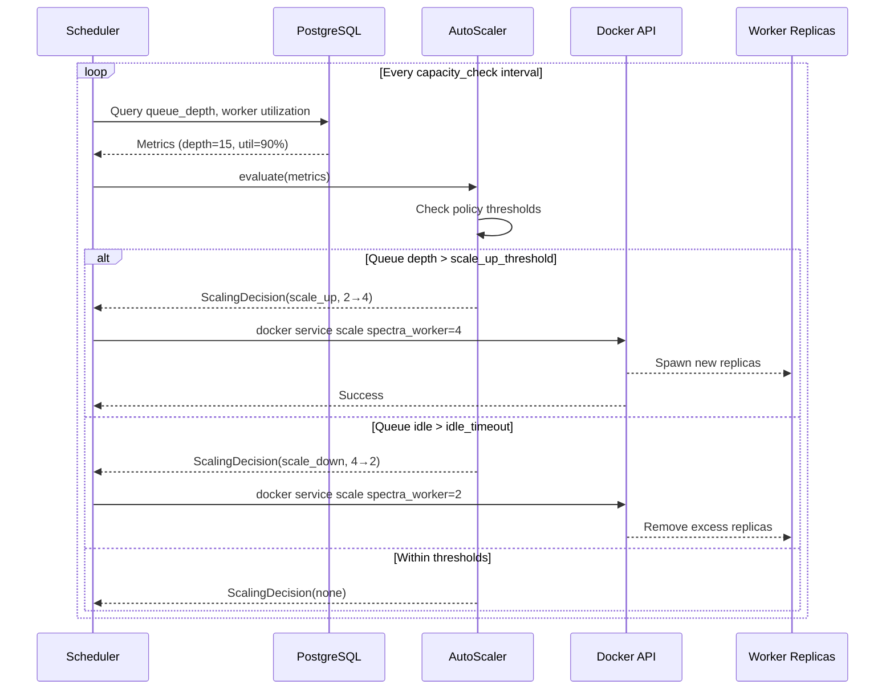
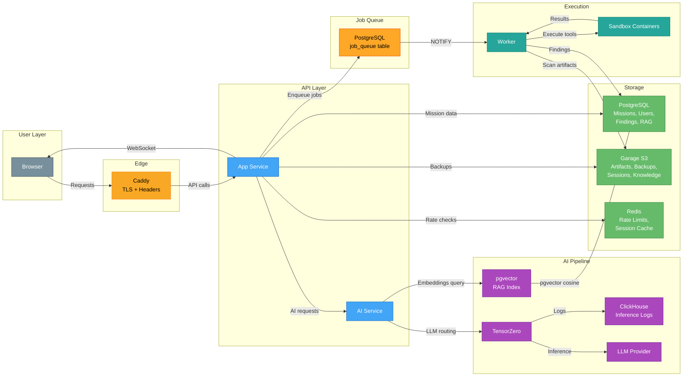
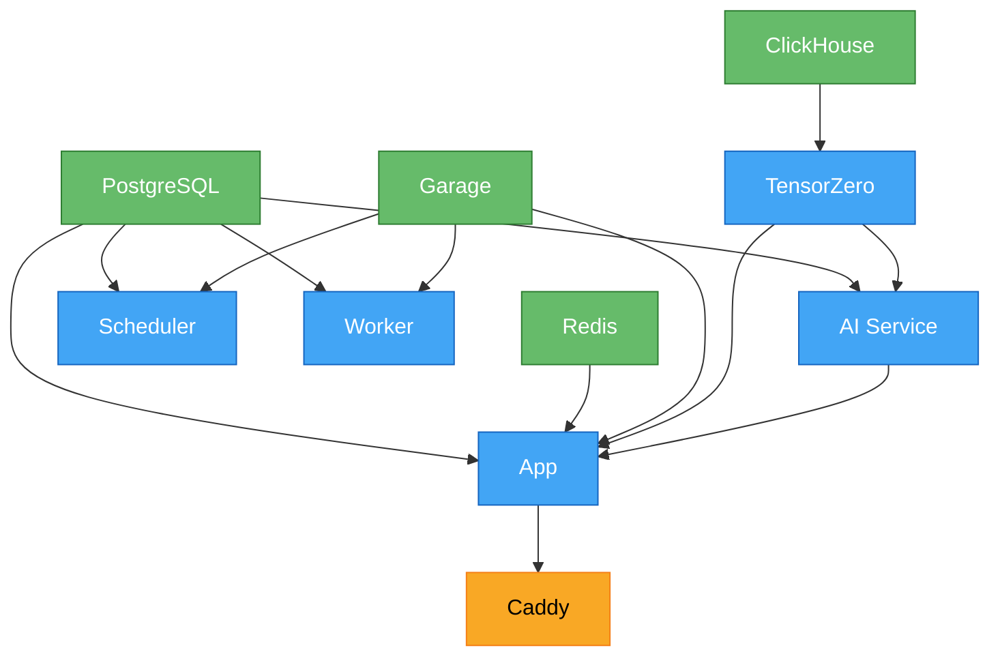
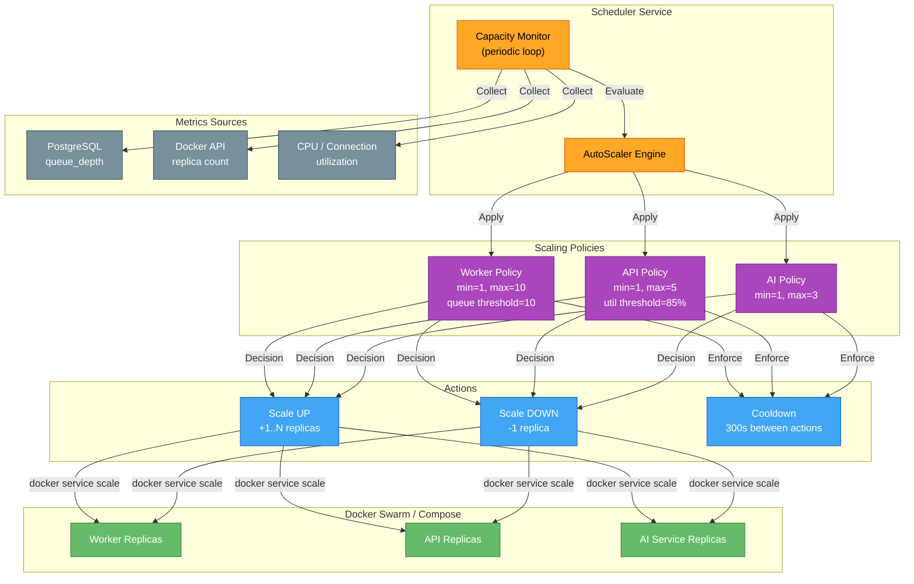
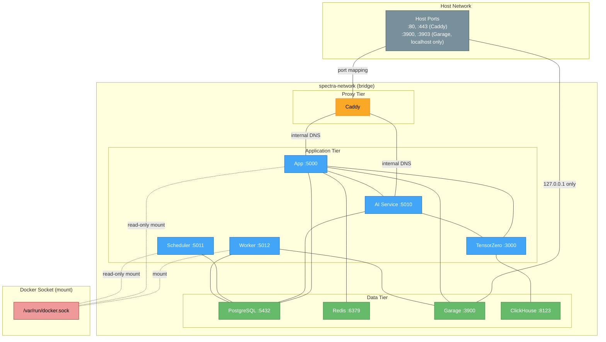

# System Topology

[← Wiki Home](home.md) | [Architecture](architecture.md) | [Microservices](microservices-split.md) | [Scaling](scaling.md)

---

Visual guide to Spectra's service topology, communication patterns, data flows, and scaling architecture.

---

## 1. Single-Node Topology

All services on a single Docker Compose host with one bridge network.



### Port Summary

| Service | Internal Port | Host Binding | Protocol |
|---------|--------------|--------------|----------|
| Caddy | 80 / 443 | `${SPECTRA_PORT}` / `${SPECTRA_HTTPS_PORT}` | HTTP/HTTPS |
| App | 5000 | — (via Caddy) | HTTP |
| AI Service | 5010 | — (via Caddy) | HTTP |
| Scheduler | 5011 | — (health only) | HTTP |
| Worker | 5012 | — (health only) | HTTP |
| PostgreSQL | 5432 | — (internal) | TCP |
| Redis | 6379 | — (internal) | TCP |
| Garage | 3900 / 3903 | 127.0.0.1 only | HTTP |
| TensorZero | 3000 | — (internal) | HTTP |
| ClickHouse | 8123 | — (internal) | HTTP |

---

## 2. Multi-Node Production Topology

A horizontally scaled deployment across dedicated node roles using Docker Swarm.



### Node Roles

| Role | Services | Scaling | Notes |
|------|----------|---------|-------|
| **Edge** | Caddy | 1 (or external LB) | TLS termination, security headers |
| **App** | App + AI Service | Horizontal | Stateless; Docker DNS round-robin |
| **Scheduler** | Scheduler | 1 only | Duplicate schedulers cause double-runs |
| **Worker** | Worker | Horizontal | `SKIP LOCKED` distributes jobs safely |
| **Data** | PG, Redis, Garage, CH | Vertical / managed | Use managed DB for HA |

---

## 3. Communication Flows

### Mission Execution Flow



### Auto-Scaling Flow



---

## 4. Data Flow Diagram



### Data Stores Summary

| Store | Data | Access Pattern |
|-------|------|---------------|
| **PostgreSQL** | Users, missions, findings, job queue, RAG vectors, audit logs | OLTP + pgvector HNSW |
| **Garage (S3)** | Scan artifacts, backups, pentest sessions, knowledge docs | Object PUT/GET |
| **Redis** | Rate limit counters, distributed locks | Key-value, TTL-based |
| **ClickHouse** | TensorZero inference logs, AI analytics | Columnar append |

---

## 5. Service Dependencies

### Startup Order

Services must start in dependency order. Docker Compose enforces this via `depends_on` with health checks.



### Startup Dependency Table

| Service | Depends On | Health Check |
|---------|-----------|--------------|
| **PostgreSQL** | — | `pg_isready -U spectra` |
| **Redis** | — | `redis-cli ping` |
| **Garage** | — | `/garage status` |
| **ClickHouse** | — | `clickhouse-client --query "SELECT 1"` |
| **TensorZero** | ClickHouse | `wget http://localhost:3000/health` |
| **AI Service** | PostgreSQL, TensorZero | `curl http://localhost:5010/health` |
| **App** | PostgreSQL, Redis, Garage, AI Service, TensorZero | `curl http://localhost:5000/api/health` |
| **Scheduler** | PostgreSQL | `curl http://localhost:5011/health` |
| **Worker** | PostgreSQL | `curl http://localhost:5012/health` |
| **Caddy** | App | `wget http://localhost:80` |

### Graceful Shutdown Order

Reverse of startup — drain traffic before stopping backends:

1. **Caddy** — stop accepting new connections, drain in-flight requests
2. **App** — close WebSocket connections, stop API handlers
3. **Scheduler** — cancel background task loops
4. **Worker** — finish in-progress jobs (or re-queue), destroy sandbox containers
5. **AI Service** — drain pending LLM requests
6. **TensorZero** — flush inference logs to ClickHouse
7. **Redis** — persist AOF
8. **Garage** — flush pending writes
9. **ClickHouse** — flush buffers
10. **PostgreSQL** — checkpoint and shutdown

---

## 6. Auto-Scaling Architecture

The reactive scaling loop runs inside the Scheduler service via the `AutoScaler` engine.



### Scaling Thresholds

| Service | Min | Max | Scale-Up Trigger | Scale-Down Trigger | Cooldown |
|---------|-----|-----|-----------------|-------------------|----------|
| **Worker** | 1 | 10 | Queue depth > 10 | Queue idle > 300s | 300s |
| **API** | 1 | 5 | Utilization > 85% | Utilization < 20% | 300s |
| **AI Service** | 1 | 3 | Utilization > 80% | Utilization < 20% | 300s |
| **Scheduler** | 1 | 1 | — (never scaled) | — | — |

### Scaling Formula (Workers)

```
desired = min(current + max(1, queue_depth ÷ threshold), max_replicas)
```

Workers scale proportionally to queue backlog. A queue depth of 30 with threshold 10 adds 3 replicas in one step.

---

## 7. Network Architecture

All services share a single Docker bridge network in Compose. Swarm deployments use an overlay network.



### Network Details

| Network | Type | Services | Purpose |
|---------|------|----------|---------|
| `spectra-network` | bridge (Compose) / overlay (Swarm) | All services | Service-to-service communication |
| Host port bindings | host | Caddy (:80/:443), Garage (:3900 localhost) | External access |
| Docker socket mount | bind mount | App (ro), Scheduler (ro), Worker (rw) | Container management |

### Security Boundaries

- **Caddy** is the only service with host-facing ports for user traffic
- **Garage** admin port (:3903) is bound to `127.0.0.1` only
- **PostgreSQL**, **Redis**, **ClickHouse** have no host port bindings
- **App** and **Scheduler** mount Docker socket read-only; **Worker** needs write access for sandbox containers
- All app services use `no-new-privileges` security option
- **App** container runs with `read_only: true` filesystem

---

## Related Pages

- [Architecture](architecture.md) — Agent system, execution pipeline, learning mechanisms
- [Microservices](microservices-split.md) — Service split, import boundaries, Dockerfile targets
- [Scaling](scaling.md) — Server pools, S3 storage, database scaling
- [Deployment Guide](deployment-guide.md) — Installation and production setup
- [Worker System](worker-system.md) — Job queue, sandbox execution details
